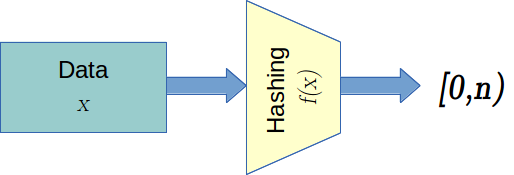
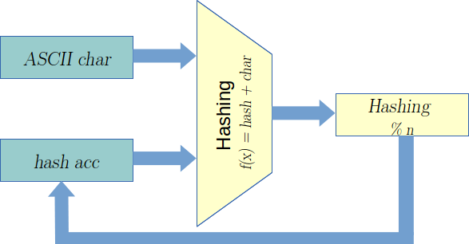
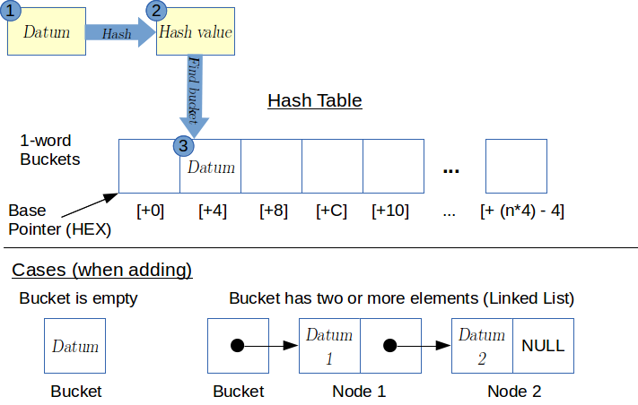

# CMPUT 229 Lab 5 - String Interning

## Information

### Hashing Functions

A *hashing function* receives data, as an input parameter, and returns a fixed-length representation of the original data. The goal of a hashing function is to uniquely identify data when possible.

<p align="center">
  
</p>

A *perfect hashing function* is a hashing function that uniquely maps every input to a unique output. When hashing unbounded variable-length strings, a perfect hashing function is not possible, because one of the prerequisites of a perfect hashing function is that the output be the same size or larger than the input.

Hashing algorithms exist along a continuum, balancing ease of computation and uniform distribution of the hashing codes. The more uniform the distribution of a given hash function, the fewer collisions, but the more computation is necessary to generate the hash. When hashing variable-length data, the data is generally taken one small unit at a time and added into an intermediate hash, forming the final hash after the last piece of data has arrived.

The hashing function used in this assignment is a simple checksum hashing, as shown below:

```
data[]
hash = 0
for d in data
	do
	hash = (hash + d) mod n
return hash
```

<p align="center">
  
</p>

This algorithm is easily written in assembly, and has good-enough variation to prevent excessive hash collisions. When implementing this hash function, ensure that the modulo is performed after each addition because when very large strings are hashed, the sum could result in overflow and that could affect the outcome.

### Hashtables

A *hashtable* is an associative data structure where an inherent property of a datum, in this case its hash, dictates the index at which that datum is stored.

The elements of a hashtable are placed into locations known as *buckets*. Buckets can vary in size. A bucket may hold as many elements as a given implementation allows.

To determine in which bucket a given datum is placed, the datum is hashed to a value (or index) that ranges in [0,n), where *n* is the size of the hashtable. The datum's hash is used as the bucket index. Thus, for a hashtable with 100 buckets, the hash value can range in [0,100).

If more entries need to be placed in a given bucket than the bucket can hold, the bucket is considered to have *overflowed*. When a bucket overflows, a pointer to an unbounded data structure replaces the element(s) stored in the bucket, and the previous elements are added to this data structure. This strategy allows a hashtable to remain functional even in the face of multiple hash collisions (i.e., when two or more elements correspond to a single bucket). Any unbounded data structured can be used. A common choice for the implementation of an unbounded data structure is a linked list. A linked list is formed by a set of nodes. Each node has two parts: the data and a pointer to the next element (the last element of the list normally has a null pointer). Linked lists are a popular choice, because they are simple to implement. Extensible arrays are also a good choice.

In this image, a graphical representation of the above procedure is shown.

<p align="center">
  
</p>

### String Interning

*String interning* is a method used to store only a single copy of each distinct string value found in an input, making it fast and easy to compare strings for equality. This is especially useful when reading and processing long text files or even code files.

An *interned string* is simply the unique identifier that, through some process, can be turned back into its address in *immutable memory*. Immutable memory is simply a type of read-only memory: our collection of interned strings will be written once and never modified, thus the immutability concept. An interned string also guarantees that any other matching string has the same unique identifier. For example, `Hello World!` will have the same interned string as `Hello World!` (when interned a second time) but not the same as `helloWorld`.

The unique identifier of an interned string differs from the mere address of a string. While the address of a string could be used to uniquely identify that string, it is not the same as the address of another string with the same exact contents. In string interning, two strings with exactly the same content should have the same unique identifier and only one copy should exist in immutable memory.

String interning is particularly useful in programs such as compilers and interpreters, where the same strings are compared a great many times. Interning strings overcomes the overhead inherent in full string comparison each time two strings must be compared.

### Memory Allocation in SPIM

For this assignment, you may need to dynamically allocate memory from the heap. This could prove useful for the unbounded data structures that must be allocated *ad hoc*, as well as strings in immutable memory.

In SPIM, dynamic memory allocation is accomplished through system call 9, `SBRK`. To use it, set `$v0` to 9, and `$a0` to the amount, in bytes, of contiguous memory needed. After the syscall, the address of the newly allocated memory will be in `$v0`. This method can be used when you are interning mutable strings (such as when `internFile` is called). To create an immutable copy, allocate sufficient memory and copy in the bytes from the original string.

You cannot assume that the memory returned is set to zero. As always, please be careful and zero your memory accordingly and as needed by your implementation.

### Immutable vs. Mutable Memory

As stated before, we will rely on the concept of mutable/immutable memory. For simplicty, assume that all the memory pointers to strings and files that your subroutines will receive as arguments live in mutable memory (i.e., you **cannot** use this memory to reference an object in your string interning data structures, because this reference is unstable). On the other hand, your string interning data structures **will** contain pointers to strings that live in immutable memory. In other words, your program will only copy each string once and keep it unmodified throughout the execution of your code.

## Assignment

In this assignment, you will implement string interning under MIPS using a hashtable and an unbounded data structure of your choice. We do recommend using linked lists. To implement string interning, you will have to implement three functions `internString`, `getInternedString`, and `internFile`. The specification for these functions are given further down, but first we need to discuss the string interning algorithm that you should use.

For your implementation, you have the guarantee that at most 128 unique strings will be interned. There are no guarantees about the string lengths or about their unique hashes.

The algorithm to perform string interning is as follows:

1. **Hash** the string to obtain a hash code that can be used to index the interning table.
1. **Examine** the entry in the interning table that is indexed by the hash code.
  1. **If zero:**
      * **create** an immutable copy of the string to be interned.
      * **place** address of the immutable string into the interning table entry.
      * **return** a unique identifier for the string.
  1. **If bit 31 is set:** an unbounded data structure has already been created for this bucket. The value in the bucket, with zero in the bit 31, is a pointer to the structure. Search the structure examining each string found:
      * **If a string in the data structure matches** the currently interning string (use full string comparisons in this step because the string being added does not yet have an identifier):
          * **return** a unique identifier for that entry.
      * **If none match:**
          * **create** an immutable copy of the string to be interned.
          * **insert** address of immutable copy of the string to be interned into the unbounded data structure.
          * **return** unique identifier.
  1. **If non-zero and bit 31 is zero,** an entry is already present:
      * load the address found in the table entry, and compare that string to the one being interned (using full string comparison):
      * **If it matches:**
          * **return** the unique identifier for the string.
      * **If it doesn't match**:
          * **create** a new unbounded data structure in overflow space.
          * **put** the entry whose address was already in the table into the new data structure first.
          * **create** an immutable copy of the string to be interned.
          * **put** the address of the immutable copy into the structure.
          * **replace** content of the bucket with an entry formed by the address of the new data structure, but with the most-significant bit equal 1.
          * **return** the unique identifier for the interned string.

This implementation uses the fact that memory addresses above `0x8000 0000` are in kernel space to ensure that no address is going to have bit 31 set. This way we can use bit 31 as a flag that signals that a value stored in a hashtable entry is a linked-list address and a direct string address. This address restriction is not universally true. In implementations where this restriction does not hold, the hash-table entries could be made larger than 1 word. You will also need some sort of overflow space for your linked lists, either pre-allocated or allocated at runtime using system calls.

You are free to design your unique identifiers in anyway that you wish. A suggestion to create such unique identifiers is to combine the bit pattern that forms the hash code for the string with a unique index into the unbounded data structure. If you ensure that the value of this unique index is zero for the first string that you place into the data structure, then the unique identifier will not change when a string is moved from the bucket to the data structure. This constraint is important, because the unique identifier would have been returned and used previously.

Your implementation of string interning must be able to both intern strings and return interned strings, and be able to tokenize and intern an entire file. To do this, you must implement 3 functions:

* `internString`
  * **Arguments:** `$a0` = address of a mutable string
  * **Return Value:** `$v0` = interned string identifier
  * It is vital that the same identifier be returned for matching strings stored in different mutable memory locations (same immutable location, however), but that strings of different values get different identifiers.
  * If the string was not interned before, the `internString` function must make an immutable copy of the string. This is a copy of the string that will reside in memory allocated by the `internString` routine.
* `getInternedString`
  * **Arguments:** `$a0` = interned string identifier
  * **Return Value:**
    * `$v0` = string address in immutable memory; if string was interned previously.
    * `$v0` = 0; if string was not interned previously.
* `internFile`
  * **Arguments:** `$a0` = pointer to a file in mutable memory
  * **Returns:**
    * `$v0` = a pointer to a list of interned-string identifiers representing each string that appears in the file in the same order that they appear. If a string appears multiple times in the file, its identifier should also appear multiple times in the identifier list. Strings should be split at each space or line feed character. ASCII table available [here](http://www.asciitable.com/).
    * `$v1` = an integer value representing the number of identifiers in the list.
  * **Execution:** Strings should be split whenever one or multiple space (`0x20`) or line feed (`0x0A`) is encountered. Multiple spaces or multiple line feed characters should be interpreted as a single string separator. The end of the file will be denoted by an End Of Transmission (EOT, ASCII value 0x04) byte. This byte should not be included in the final string.

You must implement string interning using the hashing algorithm specified above because your implementation method will be checked.

The testing file [test.s](resources/code/test.s) is provided. It simply provides you with two functions, and allows you to interactively test your string interning functionality. Each string will be passed in a different address to preserve string immutability.

## Resources

* Slides used for in-class introduction of the lab  ([.pdf](resources/slides/Lab_Interning_Class_pres.pdf))

* Slides used for in-lab introduction of the lab ([.pdf](resources/slides/Lab_Interning_Lab_pres.pdf))

* [Set of Sample Test Cases](resources/tests)

## Marking Guide

While marking, the interned string identifiers that your code returns will be treated as *black boxes*, meaning that their values will not be inspected. They will however be compared against each other for equality, and tested for properties arising from the hashtable and unbounded data structure implementation. This testing strategy allows you to construct fields within the identifiers however you choose, without any concerns that it will affect marking.

Here is the [mark sheet](MarkSheet.txt) used for grading. In particular, your submission will be evaluated as follows:

* 10% for code cleanliness, readability, comments, and correct stack frame usage.
* 16% for correct hashtable implementation
* 24% for correct unbounded data structure and collision handling
* 30% for correct implementation of `internFile`
* 20% for correctly handling edge cases (i.e., maximum number of unique strings).

## Submission

There is a single file to be submitted for this lab. The file name should be `lab5.s`, and it should contain only the code for the functions specified above. Make sure to not include a main function in your solution. Use the link provided in the course eClass page for submission.
